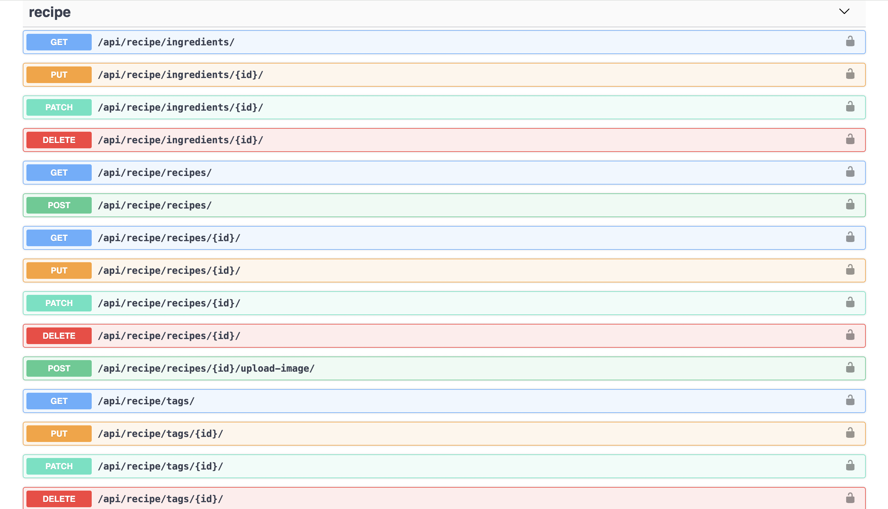

# Rarecipe API Project

A robust REST API built with Django REST Framework that allows users to manage recipes, ingredients, and tags. The API includes features like user authentication, image upload, and filtering capabilities.

## 🚀 Features

- User Authentication
- Create, Read, Update, and Delete Recipes
- Manage Recipe Tags and Ingredients
- Image Upload for Recipes
- Filtering and Sorting
- Comprehensive Test Suite
- Docker Support
- CI/CD with GitHub Actions

## 🛠 Tech Stack

- Python 3.9
- Django & Django REST Framework
- PostgreSQL
- Docker & Docker Compose
- GitHub Actions for CI/CD
- Pillow for Image Processing
- DRF Spectacular for automating Django REST APIs documentation

## 📋 Prerequisites

- Docker and Docker Compose installed
- Python 3.9 or higher (if running locally)
- Git

## 🔧 Installation & Setup

### Using Docker (Recommended)

1. Clone the repository:

```bash
git clone https://github.com/Hungle2911/rarecipe-api
cd rarecipe-api
```

2. Create environment file:

```bash
cp .env.example .env
```

3. Build and run the containers:

```bash
docker-compose up --build
```

4. Run migrations:

```bash
docker-compose run --rm app sh -c "python manage.py migrate"
```

### Local Development

1. Create a virtual environment:

```bash
python -m venv venv
source venv/bin/activate  # On Windows: venv\Scripts\activate
```

2. Install dependencies:

```bash
pip install -r requirements.txt
```

3. Set up the database:

```bash
python manage.py migrate
```

4. Run the development server:

```bash
python manage.py runserver
```

## 🧪 Running Tests

### With Docker:

```bash
docker-compose run --rm app sh -c "python manage.py test"
```

### Locally:

```bash
python manage.py test
```

## 📚 API Documentation

### API Documentation Endpoints

- `/api/docs/` - See what endpoints available



## 🐳 Docker Commands

Common commands for managing the application:

```bash
# Build and start containers
docker-compose up --build

# Run migrations
docker-compose exec app python manage.py migrate

# Run tests
docker-compose run --rm app sh -c "python manage.py test"

# Stop containers
docker-compose down
```

## 🧑‍💻 Development

1. Create a new branch for your feature:

```bash
git checkout -b feature/your-feature-name
```

2. Make your changes and commit them:

```bash
git commit -m "Add your message"
```

3. Push to your branch:

```bash
git push origin feature/your-feature-name
```

4. Create a Pull Request

## 🧪 Testing

The project includes comprehensive tests for:

- User Authentication
- Recipe Management
- Tag and Ingredient Operations
- Image Upload Functionality

Ensure all tests pass before submitting pull requests:

```bash
python manage.py test
```

## 📝 Code Style

This project follows PEP 8 guidelines. Install and run flake8:

```bash
pip install flake8
flake8
```

## 👥 Contributing

1. Fork the repository
2. Create your feature branch
3. Commit your changes
4. Push to the branch
5. Create a new Pull Request

## 🙏 Acknowledgments

- Django REST Framework documentation
- Docker documentation
- GitHub Actions documentation
